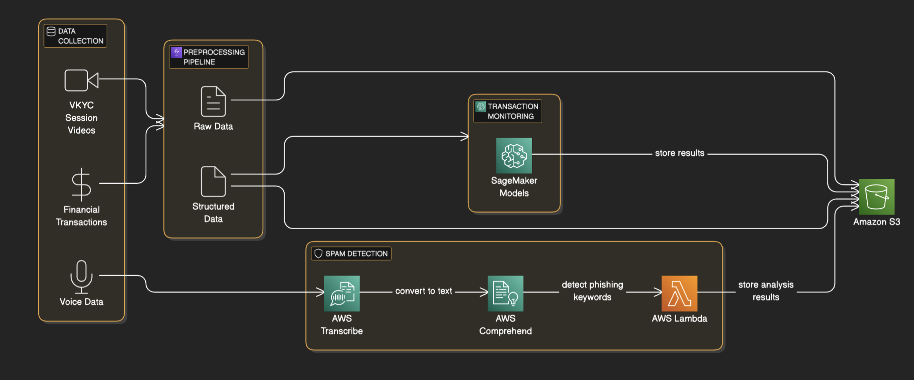

# 🔒 AI-Powered Fraud Detection System

## Overview
This project develops an AI-powered solution to detect and prevent spam calls, deepfake fraud, and VKYC exploitation in financial services. By leveraging AWS services, the system identifies suspicious activities in real-time through analysis of call metadata, behavioral patterns, and transaction data. Users are alerted instantly, enhancing trust and security in digital communication systems.

---

## ✨ Features
- 📞 **Spam Call Detection**: Converts call audio to text using AWS Transcribe and analyzes metadata and transcripts for fraud indicators.
- 🎭 **Deepfake Detection in VKYC**: Uses Amazon Rekognition and machine learning models in Amazon SageMaker to identify facial and voice anomalies.
- 💰 **Financial Fraud Detection**: Monitors transaction data using AWS Glue and SageMaker to detect suspicious activities.

🚀 Innovative Approach: Combined GANs and Random Forest models to achieve 95% accuracy in fraud detection. 🌍 Real-World Applicability: Designed a scalable, future-proof fraud detection solution adaptable to payment systems like UPI. 👩‍💻 User-Centric Design: Created a responsive UI with Google Sign-In, dashboards, and real-time alerts. 🏆 DigiPay Pro NPCI Competition Highlights Award Ceremony.
  
- 
  
- 
  
- 


- ⚡ **Real-Time Alerts**: Sends immediate notifications to users via Amazon SNS when potential threats are detected.
- 🔄 **User Feedback Loop**: Gathers user reports through a UI and incorporates feedback into system updates.

---

## 🌟 Impact
This solution has the potential to significantly reduce financial fraud and enhance user trust in digital communication systems. It:
- 🛡️ Protects vulnerable communities from scams and fraudulent activities.
- 🌍 Promotes financial security and stability, especially in regions prone to such scams.
- 🤝 Contributes to a safer and more trustworthy financial ecosystem.

---

## 🚀 Uniqueness
What sets this project apart:
- 🧩 **Comprehensive Approach**: Tackles multiple aspects of financial fraud—spam detection, deepfake analysis, and transaction monitoring—in one solution.
- ⏱️ **Real-Time Processing**: Provides real-time detection and alerts to minimize potential harm.
- 🌐 **Scalability and Reliability**: Built on AWS services, ensuring robustness in high-volume environments.
- 🧠 **Holistic Solution**: Combines advanced AI technologies and machine learning for an all-in-one fraud detection system.

---

## 🏗️ Architecture



1. **Data Ingestion**: 
   - Calls and VKYC session data uploaded to Amazon S3.
   - Transaction data ingested via AWS Glue.

2. **Processing**:
   - AWS Lambda functions analyze data for spam detection, deepfake analysis, and fraud detection.
   - Amazon SageMaker trains models for facial and voice anomaly detection.
   
3. **Alerts and Feedback**:
   - Suspicious activities trigger alerts via Amazon SNS.
   - Users provide feedback through a UI built with AWS Amplify.

---

## 🛠️ Implementation Steps
### **1. Set Up AWS Environment**
- Create AWS account.
- Configure S3, Lambda, RDS, Glue, and SageMaker.

### **2. Spam Call Detection**
- Transcribe call audio using AWS Transcribe.
- Analyze transcripts with AWS Comprehend for phishing keywords.
- Trigger real-time Lambda functions for metadata analysis.

### **3. Deepfake Detection in VKYC**
- Use Rekognition for facial analysis.
- Train SageMaker models to detect anomalies in facial features and voice patterns.
- 


### **4. Financial Fraud Detection**
- Analyze transaction patterns using Glue and SageMaker anomaly detection algorithms.
- 


### **5. Real-Time Alerts**
- Set up Amazon SNS for instant notifications.
- Develop a user interface with AWS Amplify to report and respond to threats.

---

## 🏁 Getting Started
### **Prerequisites**
- 🌐 AWS Account
- 🐍 Python 3.9+
- 💻 AWS CLI configured locally

### **Installation**
1. Clone this repository:
   ```bash
   git clone https://github.com/prashant3030223/AI-Fueled-Scam-Detection-System.git
   cd AI-Fueled-Scam-Detection-System
   
2. Install dependencies:
   ```bash
   pip install -r requirements.txt

3. Deploy AWS services using CloudFormation templates:
   ```bash
   aws cloudformation deploy --template-file
   setup/CloudFormation_Templates/S3_Bucket.yml

### ✅ Testing
- 🧪 **Unit Tests:** Located in `tests/unit_tests/`.
- 🔗 **Integration Tests:** Located in `tests/integration_tests/`.
- Run all tests:
  ```bash
   pytest tests/

---

## 📄 Documentation
For detailed documentation, refer to the `docs` folder:
- 📃 `Project Overview`
- 🛠️ `System Workflow`
- 📊 `PPT Presentation`

---

## 🤝 Contributing
1. Fork the repository.
2. Create a new branch:
   ```bash
   git checkout -b feature-name

3. Commit your changes and create a pull request.

---

## 📜 License
This project is licensed under the `MIT License`.

---

## 📬 Contact
For queries, reach out to:
- Name: Ruturaj Rahul Sonkamble
- 📧 Email: ruturajsonkamble29@gmail.com
- 🌐 GitHub: https://github.com/rajj28/E-summit2025-Final-Code
